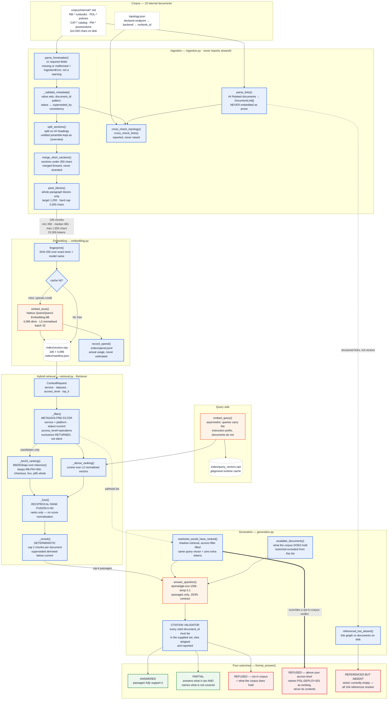

# Week 2 Architecture — TriageLens Runbook Retrieval

**Written:** 12 Sep 2026 · Describes the system as built, not as planned.

Every stage below names the file and the function that implements it. The constants quoted are the
values in the code, not targets.

---

## The pipeline

**Blue = deterministic code.** **Orange = a model call.** **Dashed = storage.** **Green = an answered outcome.** **Red = a refusal path.**

The only probabilistic steps are the two embedding calls and the single generation call. Every
filter, every ranking, every fusion, every validation and every refusal type is decided by code.

---

## Stage by stage

| Stage | File | Entry point | What it produces |
|---|---|---|---|
| Corpus | `corpus/internal/*.md`, `topology.json` | — | 19 documents, 114,540 chars |
| Frontmatter parse + validate | `ingestion.py` | `parse_frontmatter()`, `_validate_metadata()` | validated metadata, or `IngestionError` |
| Section-aware chunking | `ingestion.py` | `split_sections()` → `merge_short_sections()` → `pack_blocks()` | 106 `Chunk` objects |
| Link extraction | `ingestion.py` | `parse_links()` | `DocumentLink[]`, never embedded |
| Cross-checks | `ingestion.py` | `cross_check_topology()`, `cross_check_links()` | reported, never raised |
| Embedding + cache | `embedding.py` | `build_index()` / `load_index()` | `.index/vectors.npy`, `.index/manifest.json` |
| Spend ledger | `embedding.py` | `record_spend()` | `.index/spend.jsonl` |
| Query embedding | `embedding.py` | `embed_query()` | one 4,096-dim vector, cached |
| Metadata pre-filter | `retrieval.py` | `Retriever._filter()` | candidate positions + exclusion lists |
| Lexical arm | `retrieval.py` | `Retriever._bm25_ranking()` | ranked positions |
| Dense arm | `retrieval.py` | `Retriever._dense_ranking()` | ranked positions |
| Fusion | `retrieval.py` | `Retriever._fuse()` | RRF scores, k=60 |
| Deterministic rerank | `retrieval.py` | `Retriever._rerank()` | top-k, per-document capped |
| Restricted detection | `generation.py` | `restricted_would_have_ranked()` | which restricted docs would have ranked |
| Generation | `generation.py` | `answer_question()` | JSON brief |
| Citation validation | `generation.py` | inside `answer_question()` | validated citations + rejected list |
| Rendering | `generation.py`, `app.py` | `format_answer()` | the four outcomes |

---

## The three boundaries the diagram is drawn to show

**1. `ingestion.py`, `embedding.py`, `retrieval.py` and `generation.py` never import Streamlit.**
`app.py` renders and computes nothing. The key crosses that boundary in one direction only —
`app.py` lifts `NEBIUS_API_KEY` from `st.secrets` into `os.environ` before importing
`embedding`, because the environment is the one channel both local and Streamlit Cloud share.

**2. `## Related documents` leaves the prose path entirely.** It is parsed to structured links and
is never embedded. It feeds the dangling-reference check, not the vector index.

**3. The restricted refusal is decided before the model is called and overrides its verdict.**
The model never sees a restricted passage, so it cannot know one was withheld. Only the filter
knows, so only code can say it — which is why `restricted_would_have_ranked()` sits outside the
generation call and why its edge into `REFUSED — above your access level` is the heavy one.

---

## Constants, as implemented

| Constant | Value | Where |
|---|---|---|
| `TARGET_CHUNK_CHARS` | 1,200 | `ingestion.py` |
| `MAX_CHUNK_CHARS` | 2,000 | `ingestion.py` |
| `MIN_SECTION_CHARS` | 350 | `ingestion.py` |
| `EMBEDDING_MODEL` | `Qwen/Qwen3-Embedding-8B` | `ingestion.py` |
| `EMBEDDING_DIMENSIONS` | 4,096 (measured, not documented) | `ingestion.py` |
| `EMBEDDING_CONTEXT_TOKENS` | 32,768 | `ingestion.py` |
| `BATCH_SIZE` | 32 | `embedding.py` |
| RRF `k` | 60 | `retrieval.py._fuse()` |
| `max_chunks_per_document` | 2 | `retrieval.ContextRequest` |
| default `top_k` | 6 | `retrieval.ContextRequest` |
| `GENERATION_MODEL` | `openai/gpt-oss-120b` | `generation.py` |
| `TEMPERATURE` | 0.1 | `generation.py` |
| `MAX_OUTPUT_TOKENS` | 2,500 | `generation.py` |
